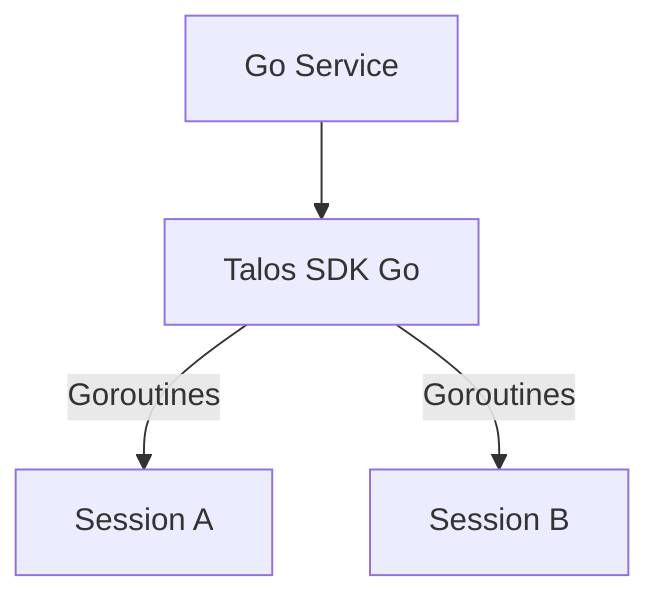

# Talos SDK for Go

**Repo Role**: Official Go implementation of the Talos Protocol, optimized for high-performance agents.

## Abstract
The Talos SDK for Go provides a concurrent-safe, high-throughput implementation of the Talos Protocol. It is designed for backend services, high-frequency traders, and infrastructure agents that require the rigorous security of the Double Ratchet with the performance of Go.

## Introduction
Go is the language of choice for cloud-native infrastructure. `talos-sdk-go` enables these infrastructure components to communicate securely. It leverages Go's strong concurrency model to handle multiple secure sessions simultaneously without locking contention.

## System Architecture



This SDK provides the same interface guarantees as the Python and TS SDKs.

## Technical Design
### Modules
- **pkg/ratchet**: Core state machine.
- **pkg/crypto**: NaCl/Ed25519 wrappers.
- **pkg/mcp**: JSON-RPC integration.

### Data Formats
- **Structs**: Strongly typed message definitions.

## Evaluation
**Status**: Alpha.
- **Conformance**: Integrating with `v1.1.0` vectors.

## Usage
### Quickstart
```bash
go get github.com/talosprotocol/talos-sdk-go
```

### Common Workflows
1.  **Start Listener**:
    ```go
    listener := talos.NewListener(identity)
    ```

## Operational Interface
*   `make test`: Run `go test`.
*   `make conformance`: Run vector tests.
*   `scripts/test.sh`: CI entrypoint.

## Security Considerations
*   **Threat Model**: Routine infrastructure compromise.
*   **Guarantees**:
    *   **Type Safety**: Compile-time guarantees against many classes of errors.

## References
1.  [Mathematical Security Proof](../talos-docs/Mathematical_Security_Proof.md)
2.  [Talos Contracts](../talos-contracts/README.md)

## License

Licensed under the Apache License 2.0. See [LICENSE](LICENSE).

Licensed under the Apache License 2.0. See [LICENSE](LICENSE).
