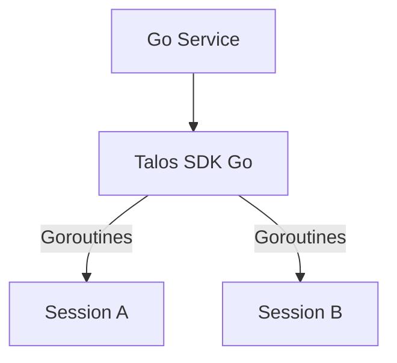

# Talos SDK for Go

**Repo Role**: Official Go implementation of the Talos Protocol, optimized for high-performance agents.

## Abstract

The Talos SDK for Go provides a concurrent-safe, high-throughput implementation of the Talos Protocol. It is designed for backend services, high-frequency traders, and infrastructure agents that require the rigorous security of the Double Ratchet with the performance of Go.

## Introduction

Go is the language of choice for cloud-native infrastructure. `talos-sdk-go` enables these infrastructure components to communicate securely. It leverages Go's strong concurrency model to handle multiple secure sessions simultaneously without locking contention.

## System Architecture


```mermaid
graph TD
    Agent[Go Service] --> SDK[Talos SDK Go]
    SDK -->|Goroutines| Session1[Session A]
    SDK -->|Goroutines| Session2[Session B]
```

This SDK provides the same interface guarantees as the Python and TS SDKs.

## Technical Design

### Modules

- **pkg/ratchet**: Core state machine.
- **pkg/crypto**: NaCl/Ed25519 wrappers.
- **pkg/talos/mcp**: JSON-RPC integration (Production ready).

### Data Formats

- **Structs**: Strongly typed message definitions.

## Evaluation

**Status**: Alpha.

- **Conformance**: `scripts/test_conformance.sh` now passes the full pinned `v1.1.0` SDK release set, including canonical JSON, signing, capability verification, frame codec, MCP signing, ratchet micro-vectors, and the `v1_1_0_roundtrip.json` golden trace.
- **A2A v1**: `pkg/talos/a2a` now provides Agent Card discovery, canonical `/rpc` helpers, Talos extension introspection, collect-style streaming helpers, callback-style per-event handling, and channel-based stream returns for `SendStreamingMessage` and `SubscribeToTask`.
- **Version Metadata**: `pkg/talos/version` exports `SDK_VERSION`, `SUPPORTED_PROTOCOL_RANGE`, and `CONTRACT_MANIFEST_HASH`, with tests that recompute the pinned manifest hash from `contracts/sdk/contract_manifest.json`.

## Usage

### Quickstart

```bash
go get github.com/talosprotocol/talos-sdk-go
```

### Common Workflows

1. **MCP Interaction**:

    ```go
    import (
        "context"
        "github.com/talosprotocol/talos-sdk-go/pkg/talos/mcp"
    )

    client := mcp.NewClient("https://gateway.talos.network", "sk-...",
        mcp.WithMaxResponseBytes(5*1024*1024))

    ctx := context.Background()

    // Invoke a tool
    resp, err := client.CallTool(ctx, "server-1", "echo", map[string]any{"msg": "hi"}, "", "")
    if err != nil {
        log.Fatal(err)
    }

    var result struct {
        Msg string `json:"msg"`
    }
    resp.DecodeOutput(&result)
    fmt.Println(result.Msg)
    ```

## Operational Interface

- `make test`: Run `go test`.
- `scripts/test_conformance.sh`: Run the pinned `v1.1.0` SDK release set.
- `scripts/test.sh`: CI entrypoint.

## Security Considerations

- **Threat Model**: Routine infrastructure compromise.
- **Guarantees**:
  - **Type Safety**: Compile-time guarantees against many classes of errors.
  - **Validated I/O**: Strict bounding on response sizes to prevent DoS.

## References

1. [Mathematical Security Proof](../talos-docs/Mathematical_Security_Proof.md)
2. [Talos Contracts](../talos-contracts/README.md)
3. [Talos Wiki](https://github.com/talosprotocol/talos/wiki)

## License

Licensed under the Apache License 2.0. See [LICENSE](LICENSE).

Licensed under the Apache License 2.0. See [LICENSE](LICENSE).

Licensed under the Apache License 2.0. See [LICENSE](LICENSE).
